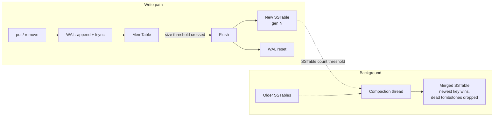

# Design

## Architecture

tiny-lsm-kv is a log-structured merge-tree: writes only ever touch an
in-memory structure and an append-only log, never a random-access seek
into a big on-disk file. That makes writes fast and durable without
in-place updates — the cost is paid on reads (possibly checking
several places for a key) and in the background (compaction), instead
of on the write path.

Four components:

- **MemTable** — an in-memory sorted map (`std::map`) of every recent
  write, with tombstones marking deletes. Sorted so it can flush
  straight into a sorted SSTable with no extra sort step.
- **WAL (write-ahead log)** — an append-only on-disk log of every
  write. Every `put`/`remove` appends a record and `fsync`s it before
  the call returns, so an acknowledged write survives a crash even
  though the MemTable holding it was only ever in memory.
- **SSTables** — immutable on-disk files holding a sorted run of
  key-value entries, produced by flushing a full MemTable once it
  crosses a size threshold. A later write to the same key lives in a
  *newer* SSTable (or the MemTable) and shadows the old one at read
  time — nothing is ever edited in place.
- **Compaction** — a background thread that merges every current
  SSTable into one once their count crosses a threshold: dropping keys
  shadowed by a newer file, and dropping tombstones once no older file
  could possibly still need them.



## Write path

1. `put`/`remove` appends a record to the WAL and `fsync`s it. The
   call does not return to its caller until the `fsync` completes —
   that is the entire durability guarantee.
2. The same write is applied to the MemTable (a real value for `put`,
   a tombstone for `remove`).
3. Once the MemTable's approximate size crosses `flush_threshold_bytes`,
   it's flushed to a new immutable SSTable (already sorted — a
   sequential write, no sort needed) and the WAL is reset, since the
   MemTable's contents are now durable in the SSTable and no longer
   need log replay.
4. Once the SSTable count crosses `compaction_trigger_count`, a
   background thread merges every current SSTable into one.

## Read path

`get(key)`:

1. Check the MemTable. If the key is there (value or tombstone), that
   is the answer — it's the newest data in the system.
2. Otherwise check on-disk SSTables from newest to oldest, returning
   the first hit.
3. If nothing is found, or the first hit is a tombstone, the key is
   absent.

`scan(start, end)` is the same idea over a range: merge the live key
ranges from the MemTable and every SSTable (newest wins per key), drop
tombstoned keys, return what's left in sorted order.

Every read has to check newest-to-oldest and respect tombstones
because the same key can legitimately exist in several places at
once — the MemTable, and any number of SSTables — and only the most
recent write (or delete) for that key is the truth.

## On-disk formats

### WAL record

Keys and values are arbitrary binary-safe strings, so records are
length-prefixed rather than delimited:

```
offset  size       field
0       4          checksum   (uint32 LE, CRC32 over bytes [4, end))
4       1          type       (1 = PUT, 2 = DELETE)
5       4          key_len    (uint32 LE)
9       4          value_len  (uint32 LE, always 0 for DELETE)
13      key_len    key bytes
13+key_len  value_len  value bytes (absent for DELETE)
```

The checksum comes first and covers everything after it, including
the length fields — they can't be trusted until the checksum that
covers them has already been verified.

A crash can leave a torn record at the tail of the file (mid-header,
mid-key, mid-value, or a complete-length record with a checksum that
doesn't match). All of these are treated identically on replay: the
log's valid contents end at the offset right before the bad record. In
a single-writer, strictly-append-only log, a torn record can only
occur at the physical tail — every earlier record was already fully
written and `fsync`'d before the next append began — so replay stops
at the first anomaly rather than scanning forward for something that
parses; skipping past it would risk silently dropping an acknowledged
write.

### SSTable

Three sections, written once and never modified:

```
[ data section  ]  one WAL-framed record per entry, sorted by key
[ index section ]  sparse: every 16th entry, as
                    (key_len u32 LE, key bytes, offset u64 LE)
[ footer        ]  24 bytes: index_offset (u64), index_size (u64),
                    entry_count (u32, informational), magic (u32)
```

The data section reuses the WAL's exact record framing, so SSTable
entries get the same per-entry checksum WAL records do — useful for
catching at-rest bit-rot in an immutable file.

**Point lookup:** binary-search the small, fully-in-memory sparse
index for the last sampled key `<= target`, which identifies exactly
one ~16-entry block as the only place the key could be, then linearly
scan just that block. Roughly `O(log(n/16))` plus `O(16)`, instead of
`O(n)` to scan the whole file or `O(n)` memory for a full index.

**Writing** an SSTable is a single batch, not an incremental append —
the whole file (data + index + footer) is written to `<name>.sst.tmp`,
`fsync`'d, then atomically `rename()`'d into place. A crash before the
rename leaves either nothing or an ignored `.tmp` file; `Database`
only ever discovers SSTables by their real, post-rename filenames.

## Durability guarantee, with a proof sketch

**Guarantee:** once `put`/`remove` returns, that write survives any
crash that happens afterward — including a crash during a later flush
or compaction.

**Proof sketch**, by induction over what could crash and when:

- *Crash before `fsync` returns in `put`/`remove`.* The write was
  never acknowledged (the call hadn't returned yet), so it's outside
  the guarantee — it's fine whether or not it happens to survive.

- *Crash right after `fsync` returns, before the MemTable/flush logic
  runs.* The record is durably in the WAL. On restart, replay reads it
  back and reapplies it to a fresh MemTable. Survived.

- *Crash during a flush, before the SSTable's `rename()`.* The WAL
  still has every record for this MemTable generation (it's only
  `Reset()` *after* the rename succeeds). On restart, the half-written
  `.sst.tmp` is ignored (never discovered — SSTables are found by
  their real post-rename name), and WAL replay rebuilds the same
  MemTable state from scratch. Survived.

- *Crash after the SSTable rename but before the WAL reset.* The new
  SSTable is durable and will be discovered on restart. The WAL also
  still has the same records (redundant, but harmless — `get()` checks
  the MemTable first and finds the same value either way). Survived,
  no double-counting since both copies agree.

- *Crash during compaction, before the merged SSTable's `rename()`.*
  The original SSTables being merged are untouched and still on disk.
  The half-written merged `.tmp` file is ignored. Survived — this
  path never touched the WAL or MemTable at all.

- *Crash after the merged SSTable's rename but before the old SSTables
  are deleted.* Both the old files and the new merged file are on disk
  and individually valid. The merged file has the highest generation
  number, so it's already treated as authoritative; the old files are
  redundant, not corrupting, and get cleaned up by the next
  compaction. Survived.

Every case bottoms out at "the WAL has it," "an already-`fsync`'d
SSTable has it," or "both agree" — there's no point on any of these
paths where a crash can land between "acknowledged" and "durable,"
because the `fsync` in `put`/`remove` *is* what makes something
acknowledged. This is checked empirically, not just argued, by
`tools/crash_recovery_harness.cpp` (see the README) — hundreds of real
`SIGKILL`s at random points across many trials, with every
acknowledged write verified present after restart.

Two things this guarantee does *not* cover, which the README's
Limitations section also calls out: it says nothing about writes that
were never acknowledged (by design — a crash mid-`put`, before its own
`fsync` returns, may or may not survive, and the caller was never told
either way), and it says nothing about surviving disk/filesystem
corruption beyond what a single CRC32 per record can catch.

## What this project doesn't do

No MVCC or snapshot isolation, no multi-key transactions, and a
single, process-wide writer lock — see the README's Limitations
section for the full list and why each one is an acceptable cut for a
project whose point is demonstrating the core LSM-tree mechanics, not
shipping a production database.
